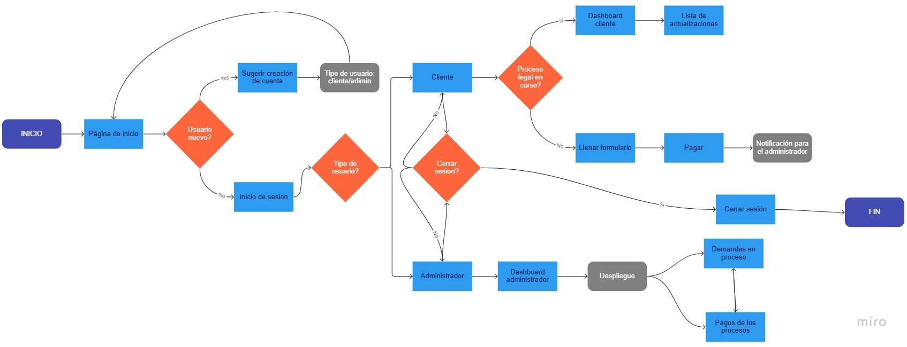

# Abogabot

## Practica
Caso ficticio en el que un despacho de abogados requiere automatizar las demandas de sus clientes... ⚖️

## Análisis de requerimientos

### En general:
Crear una plataforma web (Responsiva), donde los clientes puedan adquirir el servicio de un abogado (creando una cuenta en la plataforma), en dicha plataforma el cliente puede hacer seguimiento a su proceso legal. Los clientes recibirán correos informando sobre el estado del proceso.
Asi mismo la plataforma debe tener un lado de *Administrador* para llevar el control de las demandas.

* ### Administrador
1. El **Administrador** recibe una notificación por cada nueva demanda generada en la plataforma a traves de un formulario previamente llenado por los clientes.
 * *Se debe crear un archivo en formato **Word** *de manera automática, para poder empezar el proceso lo antes posible.*

2. El **Administrador** debe poder *recibir* y *ver* los pagos realizados por sus clientes.
    * *Estos pagos deben desplegarse en un ***Dashboard*** para su correcta visualización y manipulación.*

3. El **Administrador** puede actualizar el proceso de la demanda sobre la marcha y agregar comentarios para tener al  cliente actualizado.

* ### Cliente
1. El **Cliente** debe poder crear una cuenta el pagina web.
    * *En caso de no tener cuenta, puedes igual tienes acceso a la plataforma, sin embargo, no tendrás la posibilidad de adquirir ningún servicio.*
2. El **Cliente** debe llenar un *formulario* con la información necesaria, en caso haber adquirido el servicio.
    * *Es necesario un cuenta para este punto.*
3. El **Cliente** debe poder hacer seguimiento sobre su proceso legal.
    * *Es necesario un cuenta para este punto.*
    * *Al existir una nueva actualización en su proceso legal, al cliente se le notificara por medio de correo electrónico.*

## Diagrama de flujo

